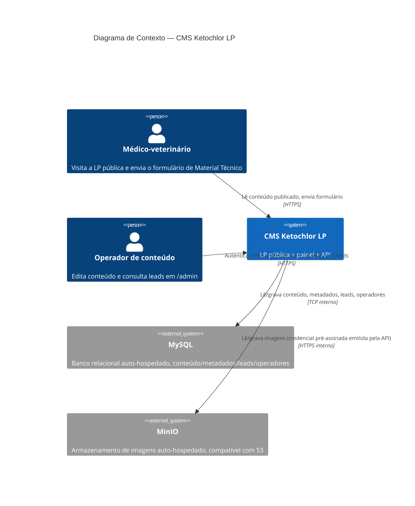
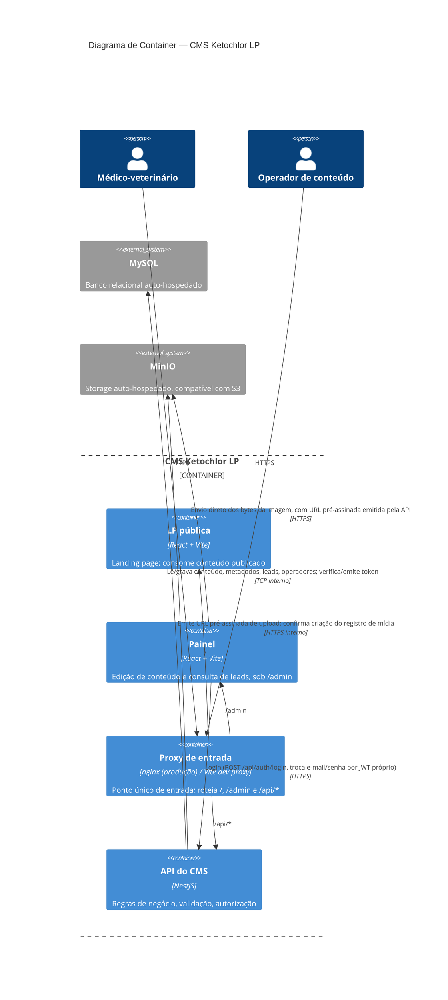

# SDD — CMS Ketochlor LP

Derivado de `agent_context/PRD.md` (aprovado). Nenhuma decisão aqui introduz capacidade que não seja rastreável a uma linha do PRD.

## Linguagem ubíqua

| Termo | Definição |
|---|---|
| **Landing page (LP)** | A página pública do Ketochlor®, hoje na raiz do repositório (`src/`). Único consumidor público do conteúdo. |
| **Painel** | A interface de administração, servida sob `/admin`, usada pelos operadores. |
| **Operador** | Pessoa autenticada que edita conteúdo e consulta leads. Todos os operadores têm o mesmo nível de acesso. |
| **Seção** | Uma das **11** áreas de conteúdo da LP editáveis pelo CMS: `hero`, `problema`, `fenotipos`, `mecanismo`, `tecnologia_sis`, `prova_autoridade`, `protocolo`, `diferenciais`, `material_tecnico`, `cta_secundario`, `faq`. O conjunto é fechado: o CMS edita seções existentes, nunca cria tipos novos. `header` e `footer` **não são seções do CMS** — permanecem fixos em código, incluindo a lista de referências bibliográficas hoje renderizada dentro do `Footer`. |
| **Documento de seção** | O registro único que guarda todo o conteúdo de uma seção, incluindo suas listas e subestruturas de cardinalidade fixa. Uma seção ↔ um documento. |
| **Esquema de seção** | A definição declarativa dos campos de uma seção: nome, tipo, rótulo em português, obrigatoriedade. É a fonte única que gera ao mesmo tempo a validação na API, o formulário no painel e os tipos consumidos pela LP. |
| **Item de lista** | Elemento de uma coleção dentro de um documento de seção com cardinalidade variável (uma estatística de Prova de Autoridade, uma linha da tabela de dosagem de Protocolo, um item comparativo de Diferenciais, uma pergunta do FAQ). |
| **Subestrutura fixa** | Campo composto de um documento de seção com cardinalidade **fechada**, editável mas não adicionável/removível pelo painel — os dois fenótipos de `fenotipos` (agudo/crônico) e as duas colunas de ativo de `mecanismo` (Cetoconazol/Clorexidina). |
| **Mídia** | Arquivo de imagem enviado pelo painel e guardado no armazenamento, referenciado por identificador dentro do documento de seção que o usa. Não há vídeo nesta versão (ver PRD § Fora de escopo). |
| **Publicação** | O ato de salvar. Não há rascunho: salvar torna o conteúdo visível na LP. |
| **Visibilidade** | Sinalizador que retira uma seção ou um item de lista da LP sem apagar o conteúdo. |
| **Metadados da página** | Título, descrição e imagem de compartilhamento usados por buscadores e previews de link. |
| **Injetor de SEO** | Componente de borda que insere os metadados no HTML antes de a resposta chegar ao navegador. |
| **Instantâneo de conteúdo** | Cópia do conteúdo publicado embutida no build da LP, usada como conteúdo de reserva quando a API está indisponível. |
| **Lead** | Registro de um envio do formulário da LP (Material Técnico), com os dados preenchidos pelo médico-veterinário visitante. O banco do CMS é o **único** lugar onde ele existe — não há integração com nenhuma plataforma externa. |

## Porte do projeto

**Médio.**

Sinais concretos do PRD que sustentam a classificação:

- **Múltiplos domínios de negócio:** o PRD descreve domínios distintos com regras próprias — conteúdo editorial (11 seções, listas e subestruturas fixas), mídia (upload de imagem), metadados de página e leads (com exigência de LGPD que os outros domínios não têm).
- **Integração externa obrigatória:** Supabase (banco, armazenamento e autenticação) é dependência declarada no PRD, não opcional.
- **Mais de um consumidor:** a LP pública e o painel consomem o mesmo conteúdo por caminhos diferentes, com exigências de segurança opostas (leitura anônima do conteúdo publicado × acesso autenticado a leads e a operações de escrita).
- **Evolução contínua esperada:** o critério de release do PRD exige que "adicionar um campo novo a uma seção existente seja uma tarefa pequena e documentada" — requisito explícito de manutenibilidade de longo prazo, incompatível com o porte Pequeno.

Porte Pequeno descartado por não atender seus critérios: 11 features de produto (não até ~5), dois consumidores com requisitos de segurança distintos (não um), uma integração externa obrigatória (Supabase) e vida útil de produção (não protótipo).

**Aplicação proporcional do porte Médio:** DDD apenas como organização de módulos por domínio, Hexagonal apenas na fronteira com serviços externos. Sem agregados, objetos de valor, eventos de domínio ou CQRS — o volume declarado no PRD é baixo (dezenas de edições por mês, poucos usuários simultâneos). Rigor além disso seria over-engineering.

## Camadas e padrão arquitetural

### Visão de tiers (processos separados, comunicação por HTTP)

| Tier | Responsabilidade | Tecnologia |
|---|---|---|
| **T1 — LP pública** | Renderiza a landing page no navegador. Lê conteúdo publicado. | React 18 + Vite 5 + TypeScript 5 + Tailwind 3 (o que já existe hoje na raiz do repositório) |
| **T2 — Injetor de SEO** | Insere `title`/`description`/`og:image` no HTML antes de a resposta chegar ao navegador. | Injeção em tempo de build (`apps/lp/scripts/injetar-metadados.mjs`, hook `postbuild`) — ver nota abaixo |
| **T3 — Painel** | Interface de edição sob `/admin`. | React 18 + Vite 5 + TypeScript 5 |
| **T4 — API do CMS** | Regras de negócio, validação, autorização, exportação de leads. | NestJS 11 (Node 20+) + TypeScript 5 |
| **T5 — Plataforma de dados** | Banco relacional, armazenamento de arquivos. Emissão de identidade passa a ser responsabilidade da própria T4 (módulo `auth`), não mais de T5 (ver "Migração de plataforma de dados: Supabase → MySQL + MinIO", abaixo). | MySQL 8 + MinIO, auto-hospedados no mesmo `docker-compose.yml` do projeto |

T1, T2 e T3 são publicados como artefatos estáticos em CDN; T4 é um serviço sempre ativo. **A LP é servida pela CDN, não pela API** — é isso que cumpre o requisito do PRD de que a indisponibilidade do CMS não derrube a página pública (resiliência via Instantâneo de conteúdo, ver "Riscos técnicos e mitigação").

**Migração de plataforma de dados: Supabase → MySQL + MinIO + auth própria (decisão de 2026-09-21, ver `agent_context/CHANGELOG.md`).** T5 deixa de ser um único fornecedor externo (Supabase = Postgres + Storage + Auth) e passa a ser dois serviços auto-hospedados (MySQL, MinIO) mais um módulo novo dentro da própria T4. Auditoria prévia do código confirmou que a arquitetura Hexagonal já isolava o Supabase inteiramente na camada de Infraestrutura — nenhuma porta do Domínio/Aplicação (`ContentSectionsRepository`, `SiteMetadataRepository`, `MediaAssetsRepository`, `LeadsRepository`, `OperadoresRepository`, `VerificadorToken`) expõe um tipo do SDK do Supabase; a troca é, por desenho, uma troca de adaptador, não uma reescrita de regra de negócio.

- **Banco (Postgres → MySQL 8):** os 5 adaptadores Supabase de `apps/api/src/infrastructure/supabase/` são substituídos por adaptadores MySQL equivalentes em `apps/api/src/infrastructure/mysql/` (um driver `mysql2` com queries parametrizadas, sem ORM — mesmo estilo direto já usado nos adaptadores Supabase, sem introduzir uma dependência pesada nova). Migrations SQL próprias (`mysql/migrations/*.sql`, aplicadas por um runner leve que rastreia o que já rodou em uma tabela `schema_migrations`) substituem o fluxo da CLI do Supabase (`supabase/migrations/`, removido). Tipos sem equivalente direto em MySQL: `jsonb` → `JSON` nativo (MySQL 5.7.8+); `uuid` como PK → `CHAR(36)`, gerado na aplicação (`randomUUID()` do Node, padrão que já existia no adaptador de mídia); `timestamptz` → `DATETIME` em UTC, padronizado na aplicação (MySQL não guarda timezone por linha); a tabela singleton `site_metadata` (hoje `id boolean PK` com `CHECK`) vira `id TINYINT(1) PRIMARY KEY DEFAULT 1` com `CHECK (id = 1)` (suportado desde MySQL 8.0.16). Row Level Security não tem equivalente em MySQL e não precisa de um: a política de hoje já era "nenhuma policy para os papéis anônimo/autenticado, só a credencial privilegiada do servidor acessa" — o mesmo efeito nasce de dar à API um usuário de aplicação dedicado, sem acesso de rede direto de LP/painel ao MySQL (nunca exposto fora da rede interna do `docker-compose`).
- **Armazenamento (Supabase Storage → MinIO):** novo serviço `minio` no `docker-compose.yml`, compatível com S3. O adaptador `SupabaseMediaAssetsRepository` é substituído por `MinioMediaAssetsRepository`, usando `@aws-sdk/client-s3` + `@aws-sdk/s3-request-presigner` (protocolo S3 padrão, o mesmo MinIO implementa) para preservar o padrão já validado pelo SDD original: a API emite uma URL pré-assinada de upload (`emitirCredencialUpload`, contrato da porta `MediaAssetsRepository` já é genérico o bastante — devolve `{ mediaAssetId, storagePath, signedUrl, token }` — não precisa mudar), e o navegador envia os bytes direto ao MinIO, sem passar pela API. `enviarImagemParaStorage` no painel troca `supabase.storage.from(bucket).uploadToSignedUrl(...)` por um `PUT` HTTP simples contra a URL pré-assinada (comportamento padrão de upload S3 pré-assinado, sem SDK cliente no navegador).
- **Autenticação (Supabase Auth → módulo próprio na API):** o módulo `auth` (já existente, hoje só verificador de token) ganha responsabilidade de EMITIR token: rota nova `POST /api/auth/login` (recebe `email`/`senha`, verifica hash, emite JWT assinado com segredo próprio da aplicação). Hash de senha via `bcryptjs` (implementação pura em JavaScript — evita compilação nativa no estágio Alpine do Dockerfile, mesma preocupação que já levou a imagem `node:22-alpine` a precisar de ajuste por causa do `@supabase/realtime-js`; ver `docs/DOCKER.md`). Emissão/verificação de JWT reaproveita a biblioteca `jose` já em uso por `JwksTokenVerificador` (HS256, segredo simétrico próprio da aplicação — `AUTH_JWT_SECRET` — em vez do segredo do Supabase), então a porta `VerificadorToken` não muda de contrato, só a implementação concreta (`AppJwtTokenVerificador` no lugar de `JwksTokenVerificador`). `Operador.id` deixa de ser o `sub` de um usuário do Supabase Auth e passa a ser gerado pela aplicação (`CHAR(36)`, mesmo padrão de UUID usado em `media_assets`/`leads`); o novo módulo de login usa esse mesmo id como `sub` do JWT, então nenhum outro módulo (`AuthGuard`, `updatedBy`/`createdBy`) precisa mudar. `ultimoLoginEm`, antes obtido de graça do Supabase Auth, passa a ser escrito manualmente pelo próprio `POST /api/auth/login` a cada autenticação bem-sucedida.
- **Painel:** `apps/admin/src/lib/supabase-client.ts` e a dependência `@supabase/supabase-js` são removidos por completo do workspace `apps/admin`. `AuthProvider`/`useAuth()` (`apps/admin/src/auth/auth-context.tsx`) troca `supabase.auth.getSession()`/`onAuthStateChange` por sessão própria: `POST /api/auth/login` guarda o JWT emitido (ex. `localStorage`, já que não há refresh token nem renovação automática nesta primeira versão — fora de escopo do PRD, que já descreve o painel como ferramenta interna de uso ocasional) e o envia como `Authorization: Bearer` em toda chamada a `/api/admin/*`; `login-page.tsx` chama a nova rota em vez de `signInWithPassword`; `signOut()` vira, simplesmente, apagar o token local (não há sessão de servidor para invalidar, mesma limitação que JWT teria com Supabase). `apps/api` também remove `@supabase/supabase-js` do seu `package.json`.

**Nota de refinamento (tarefa `seo/injetor-metadados`, ver `agent_context/CHANGELOG.md`):** a versão original desta linha descrevia T2 apenas como "função de borda da plataforma de hospedagem escolhida na implantação" — uma decisão deliberadamente adiada, já que nenhuma plataforma de borda tinha sido escolhida. Investigada a implementação real disponível hoje (nginx puro, único proxy que o projeto de fato tem — `docker/nginx.conf`), a conclusão foi que **nginx sem um módulo de scripting não consegue montar essa tag dinamicamente por requisição**: `sub_filter` (`ngx_http_sub_module`) só substitui por strings/variáveis do próprio nginx, nunca por um valor obtido de uma chamada de rede feita durante o processamento da resposta; isso exigiria `njs`/`ngx_http_js_module` (subrequests assíncronas dentro do handler) ou uma função de borda real de alguma plataforma de hospedagem — nenhuma das duas existe neste projeto hoje. Em vez de bloquear a tarefa nessa decisão de infraestrutura futura, adotou-se a mesma estratégia já usada pelo Instantâneo de conteúdo: os metadados publicados são embutidos no `index.html` **no momento do build** (script `postbuild` da LP), a partir do mesmo `content-snapshot.json` gerado pelo `prebuild`. Isso cumpre o critério de aceitação literal ("HTML da primeira resposta do servidor, sem depender de JavaScript, verificável com `curl`") porque o `index.html` final já sai do build com os valores reais — mas introduz uma diferença de comportamento em relação ao resto do CMS: só atualiza no HTML servido após um novo `npm run build`/deploy, não imediatamente após salvar no painel (ver "Riscos técnicos e mitigação" abaixo). Uma função de borda real (T2 como originalmente descrito) continua sendo a evolução natural se/quando uma plataforma de hospedagem com esse recurso for escolhida — a decisão desta tarefa não a impede, só resolve o presente sem depender dela.

### Visão de layers dentro da API (T4 — mesmo processo, chamada de método direta)

| Camada | Conteúdo | Conhece |
|---|---|---|
| **Apresentação** | Controllers, DTOs, pipes de validação, guardas de autenticação. Nenhuma regra de negócio. | Aplicação |
| **Aplicação** | Casos de uso: publicar seção, registrar mídia, receber lead, exportar leads, atualizar metadados. Orquestra domínio e portas. | Domínio, Portas |
| **Domínio** | Esquemas de seção, regras de validação de conteúdo, regras de visibilidade, invariantes do lead. Sem nenhum import de framework ou de Supabase. | Nada |
| **Infraestrutura** | Adaptadores que implementam as portas: repositórios Supabase, armazenamento, verificador de token. | Domínio (implementa suas portas) |

**Padrão arquitetural:** **Hexagonal (Ports & Adapters)**, com módulos NestJS por domínio (`content`, `media`, `leads`, `auth`, `metadata`, `operators`). Justificativa: o PRD exige que credenciais e acesso a dados fiquem confinados ao servidor e que nenhum cliente alcance a plataforma de dados diretamente para ler/gravar conteúdo — isolar MySQL/MinIO atrás de portas é o que permite testar regras de conteúdo e de lead sem tocar em serviço externo, e o que torna "adicionar um campo novo" uma mudança de esquema em vez de uma mudança espalhada por camadas. Esse isolamento é também o que tornou possível a migração de plataforma de dados (Supabase → MySQL + MinIO, ver nota acima) sem tocar em Domínio/Aplicação: a fronteira já existia antes de a migração ser decidida.

**Regra de dependência:** **estrita**. Cada camada só conhece a imediatamente inferior; o Domínio não conhece ninguém. A Infraestrutura depende do Domínio (implementa suas interfaces), nunca o contrário. Consequências obrigatórias:

- Nenhum controller contém regra de negócio; controller apenas traduz HTTP em chamada de caso de uso.
- Nenhum acesso ao MySQL ou ao MinIO acontece fora da camada de Infraestrutura.
- A LP e o painel nunca falam com o MySQL ou o MinIO para ler ou gravar conteúdo; falam sempre com a API. A única exceção é o **envio dos bytes** de uma imagem direto do navegador para o armazenamento (MinIO), com credencial temporária (URL pré-assinada) emitida pela API.

### Ponto único de entrada

O sistema tem **duas aplicações consumidas por usuário final** no mesmo domínio — a landing page e o painel — mais a API que as serve. Desde esta primeira versão do SDD:

**Declaração:** o desenvolvimento expõe **um endereço só** — `http://localhost:5173` —, com o mesmo mapa de caminhos usado em produção: `/` serve a LP, `/admin` serve o painel, `/api/*` alcança a API. O servidor de desenvolvimento da LP (Vite) é o ponto de entrada e encaminha `/admin` e `/api` para os processos correspondentes via proxy de desenvolvimento; `npm run dev` na raiz sobe os três processos de uma vez. Em produção, um proxy reverso único (nginx, servido atrás de um contêiner) cumpre o mesmo mapa de caminhos, atrás de uma porta única.

**Por que isso é regra e não conveniência:** é a parte que o operador e o visitante enxergam e a que mais facilmente quebra se cada aplicação for servida em sua própria porta durante o desenvolvimento — o roteamento só seria exercitado na tarefa de publicação, a última do plano.

### Estrutura de pastas do repositório

O repositório atual (app único na raiz) passa a ser um monorepo de workspaces, replicando a mesma separação usada com sucesso em outro projeto CMS da mesma stack:

```
/
├── apps/
│   ├── lp/                 # a landing page atual, movida da raiz
│   ├── admin/              # painel servido em /admin
│   └── api/                # API NestJS
├── packages/
│   └── content-schema/     # esquemas de seção + tipos, compartilhados pelos três apps
├── agent_context/          # documentos de processo (raiz, cobre o produto inteiro)
└── README.md               # documentação técnica (raiz, cobre o produto inteiro)
```

`agent_context/` e `README.md` permanecem na raiz e cobrem o produto inteiro: apesar da estrutura de monorepo, isto é **um** produto com **um** PRD, não sub-projetos independentes.

Diferente do precedente que inspirou esta estrutura, **não há `packages/design-tokens`** nesta versão: o PRD do Ketochlor não pede edição de estilo visual (está em "Fora de escopo"), então não há necessidade de tokens de design compartilhados como pacote próprio — cores e tipografia continuam vivendo no `tailwind.config.ts` de `apps/lp` e `apps/admin`, cada um com o seu. Introduzir o pacote sem um consumidor real seria over-engineering.

### Modelo de dados

Cinco tabelas em MySQL 8 (ver "Migração de plataforma de dados" acima para a tabela de equivalência de tipos Postgres → MySQL usada nas colunas abaixo). A quinta (`operators`) é nova — antes não existia tabela própria, o operador era integralmente um usuário do Supabase Auth.

**`content_sections`** — um registro por seção.

| Coluna | Tipo | Nota |
|---|---|---|
| `key` | `VARCHAR(64)` PK | Um dos 11 identificadores fechados de seção |
| `data` | `JSON` | Conteúdo validado contra o esquema da seção (ver abaixo) |
| `item_visibility` | `JSON` | Visibilidade por item de lista, gravada na MESMA instrução `UPDATE` que `data` — contrato obrigatório da porta `ContentSectionsRepository.atualizarConteudo` (coluna separada de `data` porque a validação de esquema descartaria o campo se estivesse dentro do documento; adicionada depois do SDD original, agora incorporada aqui) |
| `is_published` | `BOOLEAN` (`TINYINT(1)`) | Visibilidade da seção inteira |
| `updated_at` | `DATETIME` (UTC) | |
| `updated_by` | `CHAR(36)` | Operador que salvou |

Forma de alto nível do `data` por seção (o esquema completo, campo a campo, vive em `packages/content-schema` — código, não neste documento):

| `key` | Forma |
|---|---|
| `hero` | Campos de texto (eyebrow, heading, subheading, ctaLabel) + imagens (logo, imagem de campanha, selo), cada uma com `alt` obrigatório. |
| `problema` | Eyebrow, heading, lista de parágrafos, imagem com `alt`. |
| `fenotipos` | Eyebrow, heading, intro, duas subestruturas fixas (`agudo`, `cronico`: title/subtitle/body/badge), closing. |
| `mecanismo` | Eyebrow, heading, intro, duas subestruturas fixas de coluna de ativo (titulo/subtitulo/corpo), closing. |
| `tecnologia_sis` | Eyebrow, heading, body, imagem com `alt`. |
| `prova_autoridade` | Eyebrow, heading, **lista** de estatísticas (value/label/pct, item de lista — pode ser adicionada/removida/reordenada), note, imagem do selo, ctaLabel. |
| `protocolo` | Eyebrow, heading, modoUso, estabilidadeBadge, closing (product/highlight/text), **lista** de linhas de dosagem (peso/volumeMl, item de lista). |
| `diferenciais` | Eyebrow, heading, **lista** de itens comparativos (titulo/corpo). |
| `material_tecnico` | Eyebrow, heading, subheading, ctaLabel, legal, imagem da capa do guia com `alt`. Não inclui os campos do formulário em si (nome, e-mail, CRMV etc.) — esses permanecem definidos em código, conforme "Fora de escopo" do PRD. |
| `cta_secundario` | Heading, body, ctaLabel. |
| `faq` | Eyebrow (se aplicável), **lista** de perguntas (question/answer). |

**`site_metadata`** — registro único (`id TINYINT(1) PRIMARY KEY DEFAULT 1 CHECK (id = 1)`, ver "Migração de plataforma de dados" acima): `title`, `description`, `og_image_url` (`VARCHAR(2048)`, URL pública pronta para `<meta property="og:image">`, ou `null`), `updated_at`, `updated_by`. Sem coluna de URL canônica: o PRD não exige controle de URL canônica pelo painel, e uma coluna sem uso real seria uma pendência de modelagem desde o dia um.

**Correção de `og_image_media_id` → `og_image_url` (tarefa `ajustes/corrige-imagem-metadados`, achado de QA):** a coluna nasceu (`dados/migration-site-metadata`) como `uuid` pensada como referência a `media_assets.id`, mas nenhuma rota da API jamais criava esse registro — tanto o upload de metadados quanto o de imagem de seção só emitem credencial de envio direto ao Storage e devolvem a URL pública, sem um passo de confirmação que gravasse `media_assets` (lacuna já registrada em `painel/formulario-edicao-secao`). Na prática o campo nunca foi preenchível: era sempre `null`, e a tela de Metadados virou uma caixa de texto sem uso real (ninguém tem um id de `media_assets` para colar). A migration `20260910120000_rename_site_metadata_og_image_to_url.sql` renomeia a coluna e a retipa para `text`, alinhando `site_metadata` ao mesmo padrão já usado pelas imagens de SEÇÃO (`imageFieldSchema`, `{ url, alt }`): guardar a URL pública diretamente, sem indireção por `media_assets`. `validarSiteMetadata` (Domínio da API) agora valida o formato — `null`/vazio remove a imagem, string precisa começar com `http://`/`https://`, senão `422`.

**`media_assets`** — um registro por imagem enviada.

| Coluna | Tipo | Nota |
|---|---|---|
| `id` | `CHAR(36)` PK | UUID gerado na aplicação (`randomUUID()`); referenciado pelos documentos de seção |
| `storage_path` | `VARCHAR(1024)` | Caminho no bucket MinIO |
| `public_url` | `VARCHAR(2048)` | URL pública servida ao navegador |
| `mime_type`, `original_filename` | `VARCHAR(255)` | |
| `size_bytes` | `BIGINT` | |
| `width`, `height` | `INT` | Dimensões da imagem |
| `created_at` | `DATETIME` (UTC) | |
| `created_by` | `CHAR(36)` | |

Não há coluna `kind`: diferente do precedente que inspirou esta estrutura, esta versão do Ketochlor não tem vídeo (PRD § Fora de escopo) — toda mídia é imagem. Se vídeo entrar em uma versão futura, essa coluna é adicionada então, junto das colunas específicas de vídeo (duração etc.) — não antes, para não carregar campos sem uso.

**`leads`** — um registro por envio do formulário de Material Técnico.

| Coluna | Tipo | Nota |
|---|---|---|
| `id` | `CHAR(36)` PK | UUID gerado na aplicação |
| `nome`, `email` | `VARCHAR(255)` | Obrigatórios no formulário |
| `telefone`, `crmv`, `estado_cidade`, `especialidade` | `VARCHAR(255)` | Conforme campos hoje existentes em `LeadFormData` |
| `ja_cliente_virbac`, `deseja_contato_comercial` | `BOOLEAN` (`TINYINT(1)`) | |
| `origem` | `VARCHAR(255)` | Reservado para identificar a origem do envio (ex.: campanha), se necessário na implementação |
| `created_at` | `DATETIME` (UTC) | |

**Por que não existe coluna `aceite_lgpd`.** O aceite da política de privacidade é **condição de envio**: o formulário já marca o campo como obrigatório no front-end, e a API recusa (`422`) qualquer envio sem ele — nenhum registro nasce sem consentimento. Guardar uma coluna significaria gravar a constante `true` em toda linha, informação zero. A prova de consentimento é a própria existência do registro somado a `created_at`.

**`operators`** — um registro por operador do painel (tabela nova; antes o operador era integralmente um usuário do Supabase Auth, sem tabela própria — ver "Migração de plataforma de dados" acima).

| Coluna | Tipo | Nota |
|---|---|---|
| `id` | `CHAR(36)` PK | UUID gerado na aplicação; é o mesmo valor usado como `sub` do JWT emitido em `POST /api/auth/login` |
| `email` | `VARCHAR(255)` UNIQUE | |
| `nome` | `VARCHAR(255)` | |
| `senha_hash` | `VARCHAR(255)` | Hash `bcryptjs`, nunca a senha em texto plano |
| `criado_em` | `DATETIME` (UTC) | |
| `ultimo_login_em` | `DATETIME` (UTC), nulável | Escrita manual a cada `POST /api/auth/login` bem-sucedido — antes vinha de graça do Supabase Auth (`last_sign_in_at`) |

**Acesso à plataforma de dados:** nenhum cliente (LP, painel) alcança o MySQL ou o MinIO diretamente; todo acesso passa pela API, usando um usuário de aplicação dedicado no MySQL (sem privilégio de DDL em runtime) e a chave de acesso do MinIO do lado do servidor. Nem MySQL nem MinIO ficam expostos fora da rede interna do `docker-compose` (sem `ports` publicada para o host, mesmo padrão já usado pelo serviço `api` hoje). Isso substitui o Row Level Security do Postgres/Supabase (não existe em MySQL) sem perda de garantia — a política anterior já era "nenhuma policy para os papéis anônimo/autenticado, só a credencial privilegiada do servidor acessa", que é exatamente o que o isolamento de rede reproduz.

## Diagrama de arquitetura

### Contexto



### Container



## Decisões técnicas e trade-offs

- **Reuso da arquitetura de um CMS já validado, em vez de desenhar do zero.** O usuário pediu explicitamente a réplica da estrutura já construída e comprovada em outro projeto da mesma stack (monorepo, NestJS + Supabase, ponto único de entrada, instantâneo de conteúdo). Alternativa considerada: desenhar uma arquitetura nova, especificamente para o Ketochlor. Descartada — reabriria decisões já validadas em produção sem nenhum sinal do PRD que as invalide, custando tempo sem reduzir risco.
- **(Substituída em 2026-09-21 — ver entrada abaixo) Autenticação via Supabase Auth.**
- **CMS no mesmo repositório (monorepo), não em repositório separado.** Resolve o outro ponto em aberto do PRD. Alternativa considerada: repositório próprio para a API/painel. Descartada — o volume do projeto (porte Médio, poucos usuários) não justifica a sobrecarga operacional de dois repositórios para um produto com um PRD só; monorepo também é o que foi pedido explicitamente pelo usuário como réplica da estrutura de referência.
- **`data: JSON` por seção em vez de uma tabela relacional por seção.** Alternativa considerada: uma tabela própria para cada seção (ex.: `hero`, `problema` como tabelas). Descartada — o PRD proíbe criação de seções novas e o número de seções é fechado (11), mas o formato interno de cada uma varia bastante (algumas têm lista, outras não); `JSON` validado por esquema de aplicação dá a mesma garantia de integridade sem 11 migrações de schema toda vez que um campo muda.
- **Upload direto do navegador para o Storage, com credencial temporária emitida pela API, em vez de proxy de bytes pela API.** Evita que a API NestJS precise processar o corpo inteiro do arquivo, reduzindo latência e memória do processo da API — coerente com o requisito de a API nunca ser o gargalo de disponibilidade da LP. A única exceção declarada à regra de "só a Infraestrutura fala com a plataforma de dados".
- **Migração de plataforma de dados: Supabase (Postgres + Storage + Auth) → MySQL + MinIO + auth própria (decisão de 2026-09-21, a pedido explícito do usuário).** Alternativas consideradas para cada peça, todas avaliadas e descartadas em favor da opção mais simples de operar para um painel de poucos usuários internos (mesmo raciocínio de proporcionalidade já usado no porte Médio do projeto):
  - *Autenticação:* considerado um servidor de identidade self-hosted dedicado (ex. Keycloak/Ory) — descartado por adicionar um componente de infraestrutura novo (mais um serviço para operar, monitorar e atualizar) para um painel de "dezenas de edições por mês, poucos usuários simultâneos" (PRD § Premissas); um módulo próprio na API (tabela `operators`, hash `bcryptjs`, JWT `jose`) resolve o mesmo problema com o que o projeto já tem.
  - *Armazenamento:* considerado disco local em volume, servido pela própria API/nginx — descartado por eliminar o padrão de upload direto do navegador (o upload passaria a ser *proxied* pela API, reabrindo o mesmo problema de latência/memória que a decisão original de "upload direto ao Storage" já resolveu) e por não ser trivial de escalar para múltiplas réplicas. MinIO (compatível com S3) preserva o padrão de URL pré-assinada com o mesmo contrato de porta já existente (`emitirCredencialUpload`).
  - *Acesso ao MySQL:* considerada uma biblioteca ORM completa (TypeORM, Prisma) — descartada por ser peso adicional desproporcional ao volume do projeto e por já existir um padrão estabelecido de acesso direto e fino ao banco (os adaptadores Supabase de hoje já são wrappers finos sobre `.from()`/queries, não usam um ORM); `mysql2` com queries parametrizadas mantém o mesmo estilo.
  - Este é o único item desta lista que se qualifica como decisão de alto risco (troca de banco de dados) pelos critérios da skill de orquestração — decisão tomada explicitamente pelo usuário, registrada em `agent_context/CHANGELOG.md`, não inferida pelo orquestrador.
- **Sem `packages/design-tokens`.** Ver "Estrutura de pastas do repositório" acima — o PRD não pede edição de estilo, então não há tokens compartilhados a versionar como pacote.
- **Injetor de SEO implementado como injeção em tempo de build, não como função de borda por requisição (tarefa `seo/injetor-metadados`).** Alternativas consideradas: (1) `nginx` com `sub_filter` puro — descartada, não suporta valor obtido de uma chamada de rede feita durante a resposta, só variáveis do próprio nginx; (2) `nginx` + `njs` (`ngx_http_js_module`), buscando `/api/content` via subrequest a cada requisição e montando a tag dinamicamente — tecnicamente viável (confirmado via documentação oficial do módulo), mas adiciona uma dependência de infraestrutura nova (módulo de scripting no proxy) e complexidade operacional (parsing de HTML/erro de subrequest) que nenhuma outra parte do projeto tem hoje, para um ganho (metadados atualizados por requisição, não por build) que o PRD não exige explicitamente para metadados como exige para conteúdo (ver critérios de aceitação — a frase "sem exigir novo build/deploy" aparece para edição de campo de texto de seção, não para o critério de metadados); (3) função de borda de uma plataforma de hospedagem real — não descartada, mas não implementável hoje porque nenhuma plataforma foi escolhida na implantação (ver PLAN.md, fase `seo` não depende dessa escolha). Escolhida: reaproveitar a mesma estratégia já madura do Instantâneo de conteúdo (`lp/instantaneo-de-conteudo`) — um script `postbuild` (`apps/lp/scripts/injetar-metadados.mjs`) reescreve `index.html` a partir do `content-snapshot.json` já gerado pelo `prebuild`, sem chamada de rede própria, sem dependência de infraestrutura nova, e cumprindo o critério de aceitação literal ("verificável com uma requisição HTTP simples (sem executar JavaScript)"). Trade-off aceito e documentado em "Riscos técnicos e mitigação": os metadados só atualizam no HTML a cada novo build/deploy, não imediatamente após salvar no painel.

## Contratos de dados/API/interfaces

Prefixo de rota único: `/api`. Formato de erro uniforme: `{ "message": string, "statusCode": number }` (padrão de exceções HTTP do NestJS).

**Autenticação (pública):**
- `POST /api/auth/login` → recebe `{ email, senha }`; verifica hash (`bcryptjs`) contra `operators.senha_hash`; em caso de sucesso, grava `ultimo_login_em` e devolve `{ accessToken }` (JWT assinado `jose`, `sub` = `operators.id`); `401` se e-mail não existe ou senha não confere (mensagem genérica nos dois casos, para não confirmar a existência de um e-mail).

**Conteúdo público (sem autenticação):**
- `GET /api/content` → `{ sections: Record<SectionKey, SectionData>, metadata: SiteMetadata }` — apenas seções com `is_published = true` e apenas itens de lista com visibilidade ativa. Usado pela LP e, no lado do servidor, pelo Injetor de SEO.

**Conteúdo administrativo (autenticado):**
- `GET /api/admin/sections` → lista das 11 seções com estado atual (publicado/não), para a tela de listagem do painel.
- `GET /api/admin/sections/:key` → documento completo da seção (inclusive itens não publicados), para edição.
- `PUT /api/admin/sections/:key` → substitui `data` da seção; corpo validado contra o esquema daquela seção; `422` se inválido.
- `PATCH /api/admin/sections/:key/visibility` → alterna `is_published` da seção.
- `GET /api/admin/metadata` / `PUT /api/admin/metadata` → leitura/escrita de `site_metadata`.
- `POST /api/admin/media/upload-url` → emite credencial temporária (URL pré-assinada MinIO) de upload direto ao Storage e devolve o `id` reservado do `media_assets` a referenciar no documento de seção.

**Leads:**
- `POST /api/leads` (público) → cria um registro em `leads`; `422` se `nome`/`email` ausentes ou se o consentimento não foi marcado no corpo da requisição (o consentimento em si não é persistido, ver modelo de dados).
- `GET /api/admin/leads?from=&to=` (autenticado) → lista paginada, mais recente primeiro, com filtro por período.
- `GET /api/admin/leads/export.csv?from=&to=` (autenticado) → exportação da mesma listagem em CSV.
- `DELETE /api/admin/leads/:id` (autenticado) → exclusão a pedido do titular.

**Operadores (autenticado):** gestão de quem pode logar no painel — tabela própria `operators` no MySQL (antes da migração de 2026-09-21, cada operador era integralmente um usuário do Supabase Auth; ver "Migração de plataforma de dados" acima).
- `GET /api/admin/operators` → lista todos os operadores, mais recente primeiro (`criado_em desc`).
- `POST /api/admin/operators` → cria um operador (`email`, `senha`, `nome`); senha já entra com hash (`bcryptjs`) gravado, pronto para logar (sem confirmação por e-mail — quem cria entrega a senha por fora, mesmo comportamento de UX de antes); `422` se inválido (mesma validação de Domínio de antes, `validarCriacaoOperador`, sem mudança).
- `DELETE /api/admin/operators/:id` → remove um operador; `409` se `:id` é a própria conta do token ou se só resta 1 operador (as duas invariantes que travariam o próprio acesso administrativo ao painel — checadas na Aplicação, não mudam); `404` se `:id` não existe.

**Autenticação:** login e sessão são responsabilidade da própria API (`POST /api/auth/login`, acima) — o painel não fala mais com nenhum serviço de identidade externo. O token devolvido é um JWT assinado com segredo simétrico próprio da aplicação (`AUTH_JWT_SECRET`, verificado via `jose`), guardado pelo painel (`localStorage`) e enviado como `Authorization: Bearer` em toda requisição a `/api/admin/*`; a API verifica esse token em cada requisição administrativa (mesmo `AuthGuard` de antes, implementação de `VerificadorToken` trocada).

**Instantâneo de conteúdo:** script de build gera `apps/lp/src/content/content-snapshot.json` a partir de `GET /api/content` no momento do build; a LP usa esse arquivo como conteúdo de reserva se a chamada em runtime a `/api/content` falhar.

**Injetor de SEO (tarefa `seo/injetor-metadados`):** script `apps/lp/scripts/injetar-metadados.mjs`, hook `postbuild` de `apps/lp` (roda logo depois de `vite build`, reaproveitando o `content-snapshot.json` já escrito pelo `prebuild` — nenhuma chamada de rede própria). Reescreve `apps/lp/dist/index.html`, substituindo (ou inserindo, se ausente) `<title>`, `<meta name="description">` e `<meta property="og:image">` com `metadata.title`/`metadata.description`/`metadata.ogImageUrl` do instantâneo. Campo vazio/ausente preserva o que já está no `index.html` (nunca gera tag vazia nem quebra o HTML). Desde a tarefa `ajustes/corrige-imagem-metadados`, `metadata.ogImageUrl` já chega como a URL pública pronta para uso (ou `null`) — o script mantém, ainda assim, a mesma checagem defensiva de formato (`ehUrlAbsolutaHttp`) por o `content-snapshot.json` ser uma superfície de confiança um degrau abaixo do domínio da API que já valida o formato em `PUT /api/admin/metadata`.

## Critérios de aceitação por capacidade

- **Painel restrito em `/admin`:** requisição a qualquer rota sob `/admin` sem sessão válida redireciona para o login; nenhum dado de seção, mídia ou lead é retornado por `/api/admin/*` sem token válido (`401`).
- **Autenticação de equipe:** login com e-mail/senha cria sessão persistente entre recarregamentos de página; logout invalida a sessão local; mais de um usuário pode estar autenticado simultaneamente.
- **Painel de edição por seção:** as 11 seções (e só essas 11) aparecem na listagem do painel, na mesma ordem da LP; abrir uma seção mostra exatamente os campos que ela tem hoje na LP (texto, lista, subestrutura fixa, imagem).
- **Edição de campos de texto:** salvar um campo de texto em qualquer seção reflete no `GET /api/content` imediatamente após, sem exigir novo build/deploy.
- **Gestão de itens de lista:** adicionar, editar, remover e reordenar um item em Prova de Autoridade, Protocolo (dosagem), Diferenciais ou FAQ persiste a ordem e o conteúdo; a LP renderiza a lista na nova ordem. Tentar adicionar um item a `fenotipos` ou às colunas de `mecanismo` não é uma operação exposta pelo painel (cardinalidade fixa).
- **Upload de imagem:** enviar um arquivo em um campo de imagem atualiza a imagem exibida na LP após salvar; o campo `alt` correspondente é obrigatório e bloqueia o salvamento se vazio.
- **Controle de visibilidade:** marcar uma seção ou item de lista como não publicado remove-o do `GET /api/content` (e da LP) sem apagar o registro — reativar a visibilidade traz o conteúdo de volta inalterado.
- **Metadados de busca e compartilhamento:** o HTML retornado pela primeira resposta do servidor contém `<title>`, `<meta name="description">` e `<meta property="og:image">` com os valores salvos em `site_metadata`, verificável com uma requisição HTTP simples (sem executar JavaScript).
- **Consumo pelo front-end:** nenhuma seção da LP lê mais de `src/data/content.ts` — todo o conteúdo hoje hardcoded ali foi migrado para `content_sections` como estado inicial.
- **Registro de lead:** um `POST /api/leads` válido cria exatamente um registro em `leads`; um envio sem consentimento marcado é recusado com `422` e não cria registro.
- **Consulta e exportação de leads:** a tela de leads lista da mais recente para a mais antiga; aplicar um filtro de período reduz a listagem e a exportação ao intervalo escolhido; excluir um lead o remove permanentemente da listagem e da tabela.

## Dependências externas

- **MySQL 8** e **MinIO**, auto-hospedados como serviços do mesmo `docker-compose.yml` do projeto — sem nenhuma credencial ou dado hospedado por terceiro.
- **Ambiente de hospedagem** para o contêiner da API (sempre ativo), para os contêineres de MySQL/MinIO (sempre ativos, com volume persistente) e para os artefatos estáticos de LP/painel + proxy (CDN ou contêiner único, a decidir na implantação — não afeta o desenho acima, que já assume ponto único de entrada).
- Nenhuma dependência de plataforma externa de CRM/marketing (ver PRD § Fora de escopo).

## Riscos técnicos e mitigação

- **API indisponível derrubando a LP.** Mitigado pelo Instantâneo de conteúdo embutido no build (fallback estático) e pela separação de tiers (LP servida por CDN, nunca pela API).
- **Upload de imagem interrompido no meio do envio.** Mitigado por o registro em `media_assets` e a referência dentro do documento de seção só serem gravados depois que o Storage confirma o upload — um upload que falha no meio não deixa a seção apontando para um arquivo inexistente.
- **N+1 ao montar `GET /api/content`.** Risco conhecido de buscar as 11 seções uma a uma; mitigado por uma única consulta que traz todas as linhas de `content_sections` de uma vez (chave primária `key` cobre o filtro), não 11 chamadas separadas ao banco.
- **Editor apagando sem querer um campo obrigatório (ex. `alt`).** Mitigado pela validação de esquema na API (mesma fonte que gera a obrigatoriedade no formulário do painel) — o `PUT` é recusado com `422` antes de qualquer gravação parcial.
- **Deriva entre o esquema de seção e o conteúdo já salvo, ao evoluir um campo.** Mitigado por o esquema de seção viver em `packages/content-schema`, consumido tanto pela validação da API quanto pelos tipos da LP e do painel — uma mudança de campo é uma mudança em um lugar só, não em três.
- **Injetor de SEO só atualiza no build, não por requisição (descoberta da tarefa `seo/injetor-metadados`).** Diferente do resto do CMS ("salvar reflete imediatamente, sem novo build/deploy" — ver critérios de aceitação de conteúdo/metadados), o `title`/`description`/`og:image` embutidos no `index.html` só mudam depois de um novo `npm run build --prefix apps/lp` + deploy, porque a injeção acontece em tempo de build (ver "Nota de refinamento" em T2, acima), não numa função de borda por requisição — nginx puro não tem como montar essa tag dinamicamente sem `njs`/`ngx_http_js_module` ou uma função de borda real (nenhum dos dois existe no projeto). Aceitável para o caso de uso real: o operador já republica ao alterar conteúdo, por não haver reconstrução automática (PRD § Premissas). Mitigação disponível se o atraso se tornar um problema real: adotar `njs` no nginx (busca `/api/content` via subrequest e monta a tag por requisição) ou migrar para uma plataforma de borda com função de edge nativa — nenhuma das duas é necessária hoje.
- **(Corrigido pela tarefa `ajustes/corrige-imagem-metadados`) `ogImageMediaId` não era resolvível para uma URL pública.** Risco original: `site_metadata.og_image_media_id` era um `uuid` que referenciava `media_assets.id`, mas nenhuma rota da API jamais criava esse registro (o upload só emitia credencial de Storage + URL pública, sem confirmar `media_assets`) — o campo nunca continha um id de verdade, sempre `null`. Corrigido renomeando/retipando a coluna para `og_image_url text` (migration `20260910120000_rename_site_metadata_og_image_to_url.sql`) e dando à tela de Metadados o mesmo upload real (com preview) já usado pelas imagens de seção — `site_metadata.og_image_url` agora guarda a URL pública diretamente, sem indireção por `media_assets`, mesmo padrão de `imageFieldSchema`.
- **Perda de dados já existentes no Supabase de homologação durante a migração (conteúdo real das 11 seções, leads capturados, operadores cadastrados).** Este ambiente não é greenfield — o Supabase de homologação hoje tem conteúdo real do Ketochlor, leads reais e operadores reais (ver `agent_context/CHANGELOG.md`, entradas de 2026-09-09/10). Mitigado por a tarefa de migração de dados (`PLAN.md`, fase `migracao-mysql`) exportar `content_sections`/`site_metadata`/`leads` via `GET` autenticado antes de qualquer corte, migrar os arquivos de `media_assets` do Storage do Supabase para o MinIO preservando `public_url` referenciada no conteúdo (nunca apagando o bucket de origem até a migração ser verificada de ponta a ponta), e só desligar o projeto Supabase depois de uma comparação campo a campo entre o `GET /api/content` antigo e o novo.
- **Senhas de operadores não são portáveis do Supabase Auth para a tabela própria.** O hash de senha do Supabase Auth (GoTrue) não é exposto pela API pública/Admin API, então não há como migrar a senha em si sem acesso direto ao Postgres interno do Supabase (fora do padrão de acesso do projeto, que sempre foi só via HTTPS/SDK — ver `agent_context/CHANGELOG.md`, entrada de 2026-09-09 sobre a tentativa de conexão direta ter sido só um uso pontual/manual, nunca parte da aplicação). Mitigado por recriar cada operador existente na tabela nova com uma senha temporária gerada na migração, comunicada fora de banda (não por e-mail — o módulo novo não envia e-mail) a cada pessoa, com pedido explícito de troca no primeiro login; não há como evitar essa etapa manual.
- **Sem RLS, o controle de acesso ao MySQL depende inteiramente do isolamento de rede do `docker-compose`.** Diferente do Postgres/Supabase, onde RLS existia como camada extra (mesmo vazia de policies), MySQL não tem esse mecanismo. Mitigado por MySQL e MinIO nunca publicarem `ports` para o host (mesmo padrão já usado pelo serviço `api` hoje — só alcançável pela rede interna do compose) e por um usuário de aplicação dedicado no MySQL, sem privilégio de criar/alterar tabelas em runtime (`GRANT` limitado a `SELECT`/`INSERT`/`UPDATE`/`DELETE` nas tabelas do schema do CMS).

## Nível de rigor da especificação

**Spec-Anchored.** O sistema vai para produção e serve como canal comercial ativo (captação de leads de médicos-veterinários); qualquer mudança de comportamento relevante deve atualizar este SDD antes do código, registrando a mudança em `agent_context/CHANGELOG.md`.
